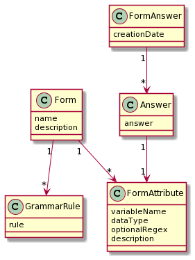

# FormWebApplication

### About the application

This application contains two main functionalities, creating forms/quizzes, and answering forms.

Through the usage of a parser, the user is able to create relatively complex forms/quizzes with the prerequisite of knowing the application's language (created through ANTLR parser).

For example, the user is able to create forms that would allow for adding dependencies to questions, e.g: if question 1 is answered as justified, then the answer to question 2 must not be empty. More examples are available on the howToUse sidebar of the application.

### How to run

Simply press the 'run' file present in this folder and open your browser on localhost:8080 url.

Note: you must have maven and java 11.

### Technologies

This web application was made using primarily java and javascript.

The spring framework was used for the 'backend', and html, css, javascript for the 'front end' with a REST architecture.

The following are some of the technologies used to obtain the back end functionalities:

-Spring HATEOAS

-Spring Web

-Other spring boot generic usages

-H2 in-memory database

-ANTLR parser

The front end exclusively uses javascript to load and manipulate the DOM as an example of avoiding refreshing to save bandwidth.

The following diagram is the business model (non-technical diagram) of the project:

### Application examples

#### Form creation page:

#### Form answer page:

#### Form answer preview questions:

#### Answering questions page:

